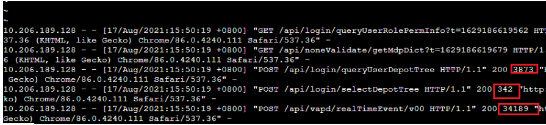

## 1、AOP使用
### 1.1 Springboo项目引入
比较简单，依赖加入start-aop即可
```xml
<dependency>
	<groupId>org.springframework.boot</groupId>
	<artifactId>spring-boot-starter-aop</artifactId>
</dependency>
```
编写Aspect方法
```java
@Aspect
@Component
public class WebLogAspect {

    private static final Logger loggger = LogManager.getLogger(WebLogAspect.class);

    @Pointcut("execution(public * com.quick.log..controller.*.*(..))")//两个..代表所有子目录，最后括号里的两个..代表所有参数
    public void logPointCut() {
    }

    @Before("logPointCut()")
    public void doBefore(JoinPoint joinPoint) throws Throwable {
        // 接收到请求，记录请求内容
        ServletRequestAttributes attributes = (ServletRequestAttributes) RequestContextHolder.getRequestAttributes();
        HttpServletRequest request = attributes.getRequest();

        // 记录下请求内容
        loggger.info("请求地址 : " + request.getRequestURL().toString());
        loggger.info("HTTP METHOD : " + request.getMethod());
        loggger.info("IP : " + request.getRemoteAddr());
        loggger.info("CLASS_METHOD : " + joinPoint.getSignature().getDeclaringTypeName() + "."
                + joinPoint.getSignature().getName());
        loggger.info("参数 : " + Arrays.toString(joinPoint.getArgs()));
//        loggger.info("参数 : " + joinPoint.getArgs());

    }

    @AfterReturning(returning = "ret", pointcut = "logPointCut()")// returning的值和doAfterReturning的参数名一致
    public void doAfterReturning(Object ret) throws Throwable {
        // 处理完请求，返回内容
        loggger.info("返回值 : " + ret);
    }

    @Around("logPointCut()")
    public Object doAround(ProceedingJoinPoint pjp) throws Throwable {
        long startTime = System.currentTimeMillis();
        Object ob = pjp.proceed();// ob 为方法的返回值
        loggger.info("耗时 : " + (System.currentTimeMillis() - startTime));
        return ob;
    }
}
```

注意：
- @Before: 在切点之前，织入相关代码；
- @After: 在切点之后，织入相关代码;
- @AfterReturning: 在切点返回内容后，织入相关代码，一般用于对返回值做些加工处理的场景；
- @AfterThrowing: 用来处理当织入的代码抛出异常后的逻辑处理;
- @Around: 在切入点前后织入代码，并且可以自由的控制何时执行切点；
- @Before和 @AfterReturning分别代表请求接入时与请求返回时，这里分别可以打印请求日志和响应内容，耗时在@Around注解的方法中可以打印，如代码所示；

如果在before和afterreturing输出请求参数与响应内容，再在around里输出耗时的话，对于单线程是没有任何问题，但是对于多线程来说，就会产生日志错位的问题，所以基于此，可以再around里完成所有参数的打印，如下：
```java
@Around("execution(* com.quick.log.controller.*.*(..))")
public Object logTome(ProceedingJoinPoint pjp) throws Throwable {
RequestAttributes ra = RequestContextHolder.getRequestAttributes();
ServletRequestAttributes sra = (ServletRequestAttributes) ra;
HttpServletRequest request = sra.getRequest();

        long startTime = System.currentTimeMillis();
        String method = request.getMethod();
        String uri = request.getRequestURI();
        String queryString = request.getQueryString();
        Object[] args = pjp.getArgs();
        String params = "";
        // result的值就是被拦截方法的返回值
        Object result = pjp.proceed();
        try {
            long endTime = System.currentTimeMillis();
            //获取请求参数集合并进行遍历拼接
            if (args.length > 0) {
                if ("POST".equals(method)) {
                    Object object = args[0];
                    params = JSON.toJSONString(object, SerializerFeature.WriteMapNullValue);
                } else if ("GET".equals(method)) {
                    params = queryString;
                }
                params = URLDecoder.decode(params, UTF_8);
            }
            StringBuilder sb = new StringBuilder(1000);
            sb.append("DateTime: ").append(DateUtil.getDatetime()).append("\n");
            sb.append("Method    : ").append(method).append("\n");
            sb.append("Params    : ").append(params).append("\n");
            sb.append("URI       : ").append(uri);
            sb.append("COST      : ").append(endTime - startTime).append("ms");

            log.info("request log:\n {}", sb);
        } catch (Exception e) {
            e.printStackTrace();
            log.error("log error !!", e);
        }
        return result;
    }
```
这样就不会出现日志错乱的问题；但是代码看起来比较累


### 1.2 SpringMVC 配置
这里要注意下是在spring-mvc.xml 开启aop代理开关，如下：

`<aop:aspectj-autoproxy proxy-target-class="true"/>`

**因为spring和spring-mvc是两个容器，并且是父子关系，父的能看到子容器实例，而子容器看不到父容器的示例，因为该切面要在controller层操作，所以需要在mvc的配置里开启，如果配置放错位置的话则切面不会生效！**

对应的切面类参见上面

## 2、拦截器使用

继承HandlerInterceptor实现，代码如下
```java
@Slf4j
public class RequestDurationInterceptor implements HandlerInterceptor {

    private NamedThreadLocal<Long> timeThreadLocal = new NamedThreadLocal<>("StopWatch-StartTime");

    @Override
    public boolean preHandle(HttpServletRequest request, HttpServletResponse response, Object handler) throws Exception {
        long beginTime = System.currentTimeMillis();
        timeThreadLocal.set(beginTime);
        return HandlerInterceptor.super.preHandle(request, response, handler);
    }

    @Override
    public void postHandle(HttpServletRequest request, HttpServletResponse response, Object handler, ModelAndView modelAndView) throws Exception {
    }

    @Override
    public void afterCompletion(HttpServletRequest request, HttpServletResponse response, Object handler, Exception ex) throws Exception {
        String jsonBody = StringUtil.getParamString("requestBody", request.getParameterMap());
        StringBuilder sb = new StringBuilder(1000);
        HandlerMethod h = (HandlerMethod) handler;
        F10Bo f10Bo = (F10Bo) SecurityUtils.getSubject().getSession().getAttribute("user");
        if (Objects.nonNull(f10Bo)) {
            sb.append("USER      : ").append(f10Bo.getUserCode()).append("/").append(f10Bo.getUserName()).append("\n");
        }
        if (StringUtil.isEmpty(jsonBody)) {
            sb.append("DateTime: ").append(DateUtil.getDatetime()).append("\n");
            sb.append("Controller: ").append(h.getBean().getClass().getName()).append("\n");
            sb.append("Method    : ").append(h.getMethod().getName()).append("\n");
            sb.append("Params    : ").append(StringUtil.getParamString(request.getParameterMap())).append("\n");
            sb.append("URI       : ").append(request.getRequestURI()).append("\n");
        } else {
            request.setAttribute("requestBody", jsonBody);
            sb.append("DateTime: ").append(DateUtil.getDatetime()).append("\n");
            sb.append("Controller: ").append(h.getBean().getClass().getName()).append("\n");
            sb.append("Method    : ").append(h.getMethod().getName()).append("\n");
            sb.append("Params    : ").append(StringUtil.getParamString(request.getParameterMap())).append("\n");
            sb.append("URI       : ").append(request.getRequestURI()).append("\n");
        }
        long endTime = System.currentTimeMillis();
        long beginTime = timeThreadLocal.get();
        long consumeTime = endTime - beginTime;

        sb.append("COST      : ").append(consumeTime).append("ms");
        log.info("RequestDurationInterceptor request param: \n {} ", sb);
    }
}

```

这里使用ThreadLocal解决多线程的问题；

### 2.1、springmvc的项目要在配置文件spring-mvc.xml配置如下
```xml
<mvc:interceptor>
<mvc:mapping path="/**"/>
<bean class="com.quick.log.interceptor.RequestDurationInterceptor"/>
</mvc:interceptor>
```
### 2.2 springboot增加WebMvcConfigurer实现类，如下
```java
@Configuration
public class WebAppConfigurer implements WebMvcConfigurer {

    @Override
    public void addInterceptors(InterceptorRegistry registry) {
        // 可添加多个
        InterceptorRegistration interceptorRegistration = registry.addInterceptor(new RequestDurationInterceptor());
        interceptorRegistration.addPathPatterns("/**");
        // 如果没有对error处理的话，会发现执行两次RequestDurationInterceptor
        interceptorRegistration.excludePathPatterns("/error");
    }
}
```


## 3、使用nginx的日志查看耗时
现在应用是前后分离，前端使用ngxin将请求转发到后台，所以可以从ngxin请求日志中看到耗时，如



默认的配置就有耗时，当然也可以重新格式化日志，也能实现参数等较复杂的打印；

但是研发排查问题的时候大部分还是看后台的日志

##4、使用apm链路追踪
云厂商上的服务有各自的应用监控，这样就有系统化的的平台去监控应用各接口的耗时，从controller层一直到dao层都能监控到耗时，但是看不到参数；而且对私有化部署的服务，这种监控显然太重，不适合；


